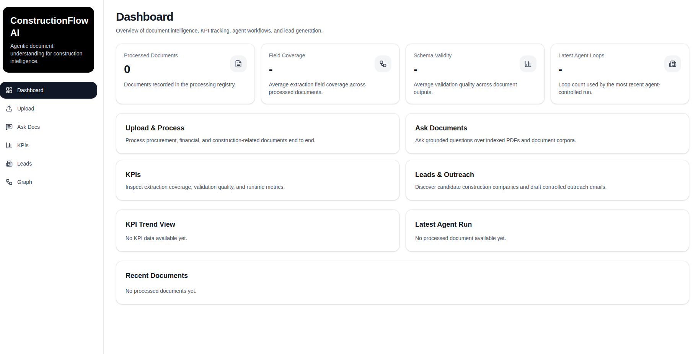

# 🏗️ ConstructionFlow AI  
### Agentic Document Intelligence for Construction & Procurement

<p align="center">
  
</p>

---

## 🚀 Overview

ConstructionFlow AI is a **production-grade agentic system** for understanding and acting on real-world business documents.

It goes beyond extraction pipelines by introducing an **AI reasoning loop** that:

- 🧠 interprets documents with LLM-driven decisions  
- 🔎 retrieves context via RAG (Pinecone)  
- 📄 extracts structured data from unstructured PDFs  
- 📊 evaluates itself using KPI metrics  
- 🎯 produces business outputs (lead generation & outreach)

> This is not a pipeline.  
> This is a system that **reasons, acts, validates, and improves**.

---

## 🧠 Core Idea

Traditional systems: 

- parse → extract → done ❌

---
## ConstructionFlow AI:


- analyze → decide → act → evaluate → retry → finalize ✅

---
## 🔁 Agentic Workflow

```text
START
  ↓
document_intake
  ↓
clean_text
  ↓
classify_document
  ↓
AGENT LOOP:
    - analyze state
    - decide next action
    - call tool
    - evaluate result
    - retry if needed
  ↓
extract_fields
  ↓
validate_document
  ↓
index_document
  ↓
log_kpis
  ↓
END

---

## ⚙️ Capabilities

### 📄 Document Intelligence
 - OCR (scanned PDFs/images)
 - semantic parsing
 - structured extraction

### 🔎 Retrieval-Augmented Generation
 - Pinecone vector indexing
 - semantic search
 - grounded answers

### 📊 KPI Evaluation
 - field coverage
OPENAI_API_KEY=
PINECONE_API_KEY=
INDEX_NAME=
TAVILY_API_KEY=
LANGSMITH_API_KEY= - schema validity
 - extraction accuracy
 - loop efficiencyOPENAI_API_KEY=
PINECONE_API_KEY=
INDEX_NAME=
TAVILY_API_KEY=
LANGSMITH_API_KEY=

### 🧲 Lead Generation
  - company discovery
  - LLM-assisted outreach drafting
  - human-in-the-loop approval

### 🧠 Explainability
 - full agent trace
 - decision transparency
 - tool usage logs


## 🏗️ Architecture

### Backend
 - FastAPI
 - LangGraph (agent loop)
 - LangChain (tools)
 - Pinecone (vector DB)
 - Tesseract (OCR)
 - Pydantic (validation)

### Frontend
 - Next.js (App Router)
 - TailwindCSS
 - Recharts

### Infrastructure
 - Vercel (frontend + serverless backend)
 - Python 3.12
 - uv (dependency manager)


## 📂 Project Structure

agentic-document-understanding/
│
├── backend/
│   ├── app/
│   │   ├── api/
│   │   ├── services/
│   │   ├── workflows/
│   │   ├── models/
│   │   └── core/
│   └── api/main.py
│
├── frontend/
│   ├── app/
│   ├── components/
│   └── lib/api.ts
│
└── agentic-doc.png


## 🧠 Agent Trace Example

{
  "loop": 1,
  "decision": "Extract financial fields",
  "tool": "extract_financial_data",
  "confidence": 0.72
}
{
  "loop": 2,
  "decision": "Validate extraction",
OPENAI_API_KEY=
PINECONE_API_KEY=
INDEX_NAME=
TAVILY_API_KEY=
LANGSMITH_API_KEY=  "result": "schema mismatch",
  "action": "retry extraction"
}
{
  "loop": 3,
  "decision": "Finalize",
  "confidence": 0.94
}
OPENAI_API_KEY=
PINECONE_API_KEY=
INDEX_NAME=
TAVILY_API_KEY=
LANGSMITH_API_KEY=

## 📊 KPI System

> Key performance indicators used to evaluate the effectiveness of the Agentic Document Understanding pipeline.

| 🧩 Metric            | 📖 Description                          |
|---------------------|----------------------------------------|
| **Field Coverage**   | % of required fields successfully extracted |
| **Extraction Accuracy** | Accuracy of extracted values vs ground truth |
| **Schema Validity**  | Conformance to expected JSON/schema structure |
| **Loop Count**       | Number of reasoning iterations (efficiency metric) |


## 🔌 API

### 📄 Documents
- **POST** `/documents/upload` — Upload and process documents  
- **GET** `/documents/history` — Retrieve document history  

### ❓ Query (RAG)
- **POST** `/query` — Ask questions over ingested documents  

### 📊 KPIs
- **GET** `/kpis` — Fetch system performance metrics  

### 🎯 Leads
- **POST** `/leads/search` — Discover relevant leads  
- **POST** `/leads/draft-email` — Generate outreach emails  

### 🔗 Graph
- **GET** `/graph/export` — Export agent workflow graph  

---

## 🖥️ UI

### Pages & Purpose
- **Dashboard** → System overview  
- **Upload** → Document ingestion  
- **Ask Docs** → RAG-based querying  
- **KPIs** → Performance monitoring  
- **Leads** → Outreach generation  
- **Graph** → Agent workflow visualization  

---

## ⚙️ Local Setup

### 1. Clone Repository
```bash
git clone https://github.com/promzyadiole/agentic-document-understanding.git
cd agentic-document-understanding

## Backend

cd backend

# Create virtual environment
uv venv
source .venv/bin/activate

# Install dependencies
uv sync

# Run server
uvicorn app.main:app --reload

##Frontend

cd frontend

# Install dependencies
npm install

# Start development server
npm run dev


## 🔑 Environment Variables
Create a .env file in the backend directory:

OPENAI_API_KEY=
PINECONE_API_KEY=
INDEX_NAME=
TAVILY_API_KEY=
LANGSMITH_API_KEY=


## 🚀 Deployment
### Frontend
- Vercel → frontend/

### Backend
- Vercel Serverless → backend/
- Python 3.12
- Entry: api/main.py


## ⚠️ Limitations
- OCR depends on environment (Tesseract)
- serverless file system is ephemeral
- large documents may be slow


##🔮 Future Work
- multi-agent orchestration
- streaming reasoning traces
- improved OCR fallback
- persistent storage layer


##👤 Author

- Promise Adiole

## ⭐ Final Thought

> This project is not about calling an LLM.

> It is about building a system that can:

- → reason
- → act
- → validate
- → improve

> in real-world document workflows.
