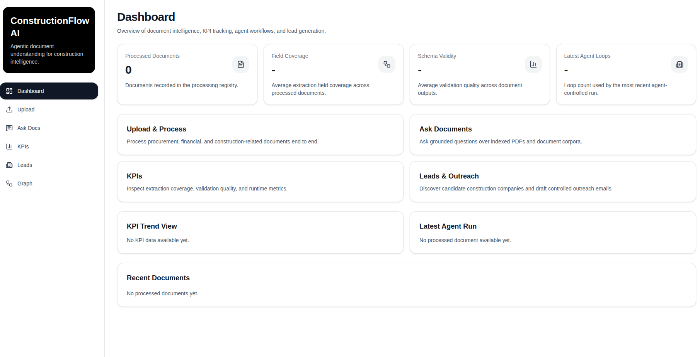
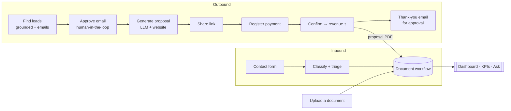
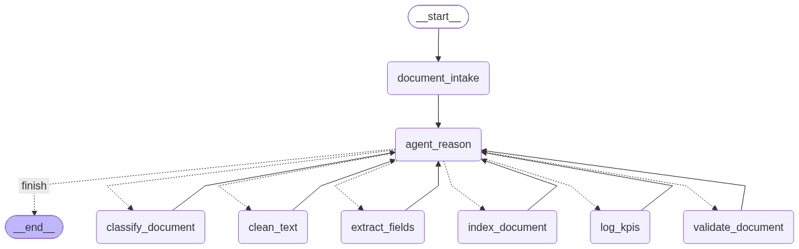
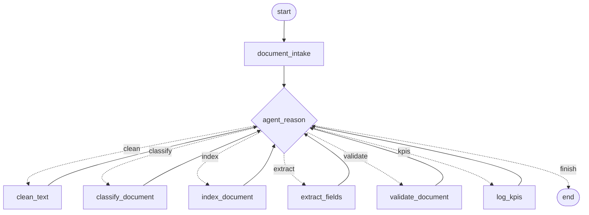

# 🏗️ ConstructionFlow AI
### Agentic Document Intelligence + Outreach-to-Revenue engine — by **Proziem Digital Global**

<p align="center">
  
</p>

<p align="center">
  <b>An LLM-agent platform that reads real-world documents, wins clients, and closes revenue — end to end.</b><br/>
  FastAPI · LangGraph · LangChain · <b>OpenAI</b> · Pinecone · Tavily · Next.js
</p>

---

## 🧠 What this is

ConstructionFlow AI has **two halves that feed each other**:

1. **Document intelligence** — a self-correcting LangGraph agent that OCRs, classifies, extracts (with evidence), validates, indexes, and answers questions over construction & procurement documents.
2. **Outreach → Proposal → Revenue** — discover leads, draft approval-gated emails, generate **LLM-written proposals aligned to each company's website**, register & confirm payments, and route every signed proposal and inbound inquiry **back through the same document workflow**.

Nothing is a black box: every extracted field carries a source snippet, every agent decision is traced, every outbound email is human-approved, and the agent loop streams its reasoning live.

---

## ✨ Highlights

**Document side**
- 🤖 **Real LLM extraction** — schema-constrained extraction via LangChain, each field grounded in a **verbatim evidence span** (not regex).
- 🔁 **Self-correcting agent** — when validation fails, the LangGraph controller re-extracts with the validation errors as feedback.
- 📡 **Live reasoning stream** — the agent's decisions stream to the UI over Server-Sent Events as it works.
- 🔎 **Grounded RAG** — full-chunk retrieval over Pinecone with inline `[Source N]` citations.
- 🧭 **Interactive workflow graph** — the live LangGraph topology, highlighting the path each run took.

**Business side**
- 🧲 **Grounded lead-gen** — Tavily + LLM scoring that only claims what the page supports, and **extracts contact emails**.
- ✅ **Human-in-the-loop email approval** — nothing is sent until you review and approve it.
- 📄 **LLM proposal generation** — the model reads the company's website and writes a full, aligned proposal (hero, deliverables, process, pricing, terms) on a shareable page.
- 💰 **Revenue tracking** — register & confirm payments; confirmed income increments on the dashboard.
- 🔄 **Closed loop** — confirming a payment renders the proposal to PDF and runs it **through the document workflow**; a **thank-you email is drafted for your approval**.
- 📥 **Inbound triage** — the landing-page Contact form classifies each message (category, priority, next action) and processes it through the workflow.

---

## 🔗 The end-to-end flow


```mermaid
flowchart LR
  subgraph Inbound
    C[Contact form] --> CL[Classify + triage]
    CL --> W
  end
  subgraph Outbound
    L[Find leads<br/>grounded + emails] --> A[Approve email<br/>human-in-the-loop]
    A --> P[Generate proposal<br/>LLM + website]
    P --> S[Share link]
    S --> PAY[Register payment]
    PAY --> CONF[Confirm → revenue ↑]
    CONF --> TY[Thank-you email<br/>for approval]
  end
  CONF -->|proposal PDF| W[(Document workflow)]
  U[Upload a document] --> W
  W --> DASH[[Dashboard · KPIs · Ask]]
```

## 🔁 The LangGraph document workflow

The `agent_reason` node is the hub: it inspects state and routes to each tool, looping back until it decides to finish (and re-extracting when validation fails).

<p align="center"></p>


```mermaid
graph TD
  START([start]) --> intake[document_intake]
  intake --> agent{agent_reason}
  agent -. clean .-> clean[clean_text]
  agent -. classify .-> classify[classify_document]
  agent -. index .-> index[index_document]
  agent -. extract .-> extract[extract_fields]
  agent -. validate .-> validate[validate_document]
  agent -. kpis .-> kpis[log_kpis]
  clean --> agent
  classify --> agent
  index --> agent
  extract --> agent
  validate --> agent
  kpis --> agent
  agent -. finish .-> END([end])
```

---

## 🧱 Architecture

```text
                 ┌──────────────────────────┐
                 │   Next.js frontend       │  Landing (Proziem) · Dashboard · Upload
                 │   (Netlify)              │  Ask · KPIs · Inbox · Leads · Approvals
                 └────────────┬─────────────┘  Proposals · Revenue · Graph
                              │ REST + SSE
                 ┌────────────▼─────────────┐
                 │   FastAPI backend        │  (Render, Docker + Tesseract)
                 └────────────┬─────────────┘
        ┌───────────┬─────────┼───────────┬─────────────┐
        ▼           ▼         ▼           ▼             ▼
   LangGraph    LangChain   OpenAI                   Tavily
   agent loop   extraction  + embeds                 lead search
        │                    │  (proposals too)
        ▼                    ▼
   Pinecone            JSON stores (registry, KPIs,
   vector DB           outreach, proposals, payments, inbound)
```

---

## 🔌 API (selected)

| Area | Endpoints |
|---|---|
| Documents | `POST /documents/upload`, `POST /documents/upload/stream` (SSE), `GET /documents/history` |
| Query (RAG) | `POST /query` |
| KPIs | `GET /kpis` |
| Leads | `POST /leads/search` |
| Outreach | `POST /outreach`, `POST /outreach/{id}/approve`, `POST /outreach/{id}/reject` |
| Proposals | `POST /proposals/generate`, `GET /proposals/{id}`, `GET /proposals/token/{token}` |
| Revenue | `POST /revenue/payments`, `POST /revenue/payments/{id}/confirm`, `GET /revenue/summary` |
| Contact | `POST /contact`, `GET /contact/inbound` |
| Firm | `GET /proposals/agency/profile` |
| Graph | `GET /graph/export` |

---

## ⚙️ Local setup

**Backend**
```bash
cd backend
cp .env.example .env      # fill in your keys
uv venv && source .venv/bin/activate && uv sync
# (Tesseract must be installed on your machine for OCR)
uvicorn app.main:app --reload
```

**Frontend**
```bash
cd frontend
cp .env.example .env.local   # NEXT_PUBLIC_API_BASE_URL=http://127.0.0.1:8000
npm install
npm run dev
```

---

## 🔑 Environment variables

See [`backend/.env.example`](backend/.env.example) and [`frontend/.env.example`](frontend/.env.example). Key ones:

| Variable | Purpose |
|---|---|
| `OPENAI_API_KEY` | extraction, classification, RAG, embeddings, proposal generation |
| `PINECONE_API_KEY` / `INDEX_NAME` | vector store |
| `TAVILY_API_KEY` | lead research |
| `FRONTEND_ORIGINS` | CORS allow-list (Netlify URL in prod) |
| `PUBLIC_BASE_URL` | backend's own URL (asset links) |
| `NEXT_PUBLIC_API_BASE_URL` | frontend → backend URL |

---

## 🚀 Deployment

- **Frontend → Netlify** — [`netlify.toml`](netlify.toml) (base `frontend`, `@netlify/plugin-nextjs`). Set `NEXT_PUBLIC_API_BASE_URL` to the Render URL.
- **Backend → Render** — [`render.yaml`](render.yaml) + [`backend/Dockerfile`](backend/Dockerfile) (Docker image with Tesseract). Set the secret env vars in the Render dashboard.

> Pinecone persists across deploys. The JSON stores (registry, KPIs, proposals, payments, inbound) are convenient for a demo but reset on a free-tier redeploy — attach a Render disk or a Postgres/Supabase layer for durable persistence.

---

## ⚠️ Notes & limitations

- OCR requires the Tesseract binary (bundled in the Docker image).
- Proposal generation and confirmation call live LLM APIs, so they incur cost.
- Outbound emails are **drafted only** — the human approves; wiring an actual sender (e.g. Resend) is the next step.

---

## 👤 Author

**Promise Adiole** — Proziem Digital Global · promzy007adiole@yahoo.com
